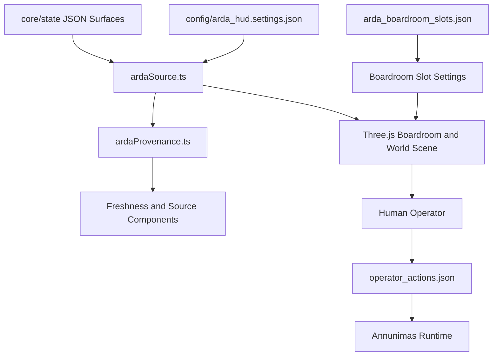

---
soterion:
  sigil: "SCROLL"
  glyph: "📜"
  code_point: "U+1F4DC"
  role: "documentation"
  owner: "HADES"
  status: "active"
  last_reviewed: "2026-06-23"
---

> 🜏 Soterion: 📜 documentation | owner: HADES | status: active | reviewed: 2026-06-23

# sigil: REPAIR
# ARDA HUD

ARDA HUD is the operator-facing frontend for Annunimas. The executable app lives
in `apps/arda-hud`, but its runtime data contract is rooted in `/core/state`,
`/human`, and `config/arda_hud.settings.json`.

## Vision

ARDA HUD is the operator cockpit for the agentic OS: it turns Annunimas state,
task queues, source provenance, council surfaces, and runtime health into a
visual environment where a human can inspect, approve, redirect, or stop agentic
work. Its job is not to hide autonomy behind dashboards; it makes the
inspect-act-verify loop visible and governable.

## Architecture Overview



## Current Reality

- frontend stack: React 19 + TypeScript + Vite
- desktop shell: Tauri 2
- current machine-readable path contract: `config/arda_hud.settings.json`
- current human-readable baseline: `README.md` + `INDEX.md`
- current operating-surface evidence plan: `ARDA_CONTRACTS_MANIFEST.md` and `INDEX.md`
The old template-era README and host-specific system note are retired. Treat the
files above as the current source of truth for what ARDA HUD consumes and how it
is intended to operate.

## Active Documentation

- `INDEX.md` — top-level doc map and routing
- `ARDA_CONTRACTS_MANIFEST.md` — authority map for cross-cutting contracts
- `ARDA_HUD_INTEGRATION.md` — pending integration target (state-source proof plan)
- `docs/contracts/ARDA_ASSET_PERFORMANCE_BUDGET.md` — scene asset size budgets
- `docs/contracts/ARDA_BOARDROOM_SLOT_ASSIGNMENT_CONTRACT.md` — boardroom slot surface-layout authority
- `docs/contracts/ARDA_DATA_PROVENANCE_CONTRACT.md` — source provenance/freshness rules
- `docs/contracts/ARDA_WORLD_DISTRICT_CONTRACT.md` — world district field/action/urgency rules
- `src/scene/ARDA_SCENE_CONTRACTS.md` — merged scene-level contracts
- `src/scene/systems/CONTRACTS.md` — merged system-level scene contracts
- `docs/archived/` — historical artifacts kept for context only

## Active Implementation Boundary

Current ARDA work targets the active Three.js/WebGL scene runtime inside the
Tauri shell:

- boardroom/world scene systems under `src/scene/**`
- scene assets and budget gates under `src/assets/scene/**`
- in-scene workstation surfaces plus explicit native Tauri pop-out windows
- boardroom monitor/desk `surface_layout` assignments backed by
  `core/state/arda_boardroom_slots.json`

Do not revive the retired rail-layout/dashboard shell as the implementation
target. The remaining operating rail is a control/status layer over the active
scene, not the product architecture to expand. Host Vite/browser is allowed only
for fast React/CSS iteration; final proof is native Tauri/WebKit through the
stable `lothlorien` path described below.

## Document History and Supersession

The long-form supersession table has been removed. See `INDEX.md` for the
current active/archived doc map and the canonical source of truth for each
contract.

## Runtime Contract

ARDA HUD is currently built around these state surfaces:

- `core/state/arda_snapshot.json`
- `core/state/arda_source_map.json`
- `core/state/world.json`
- `core/state/human_context.json`
- `core/state/runtime_settings.json`
- `core/state/package_health.json`
- `core/state/storage_pressure.json`
- `core/state/queue_summary.json`
- `core/state/operator_actions.json`
- `core/state/arda_boardroom_slots.json`

The app-specific hookup for plan roots and state paths is configured in:

- `config/arda_hud.settings.json`

The runtime bundle also exposes `sourceProvenance` records from
`src/lib/ardaSource.ts`. These records use `src/lib/ardaProvenance.ts` to carry
operator-facing provenance and freshness metadata:

- source domain id and label
- source paths
- generated and observed timestamps when known
- freshness state: `fresh`, `stale`, `missing`, `derived`, `blocked`, or
  `unknown`
- source kind: `snapshot`, `live`, `derived`, `config`, or `manual`
- optional safe refresh command and last refresh result

Reusable display components live under `src/components/arda/modules/`:

- `DataFreshnessBadge.tsx`
- `DataSourceDetailsPanel.tsx`

These components are presentation-only. They may show safe refresh guidance, but
they do not execute refresh or mutation commands from the HUD.

## Boardroom Surface Contract

Boardroom monitor/desk assignments are backed by:

- authority file: `core/state/arda_boardroom_slots.json`
- frontend contract: `src/lib/boardroomSlotSettings.ts`
- human contract: `ARDA_CONTRACTS_MANIFEST.md`

Each slot can include a `surface_layout` with:

- adapter type
- preview mode
- preview widgets
- preview refresh cadence
- focus mode and target
- embed URL
- inline-embed policy

Settings displays this data for all upper monitor and desk slots and can edit
core surface fields, multi-widget preview composition, per-widget bindings, and
service presets. The boardroom preview layer renders compact widgets from this
contract. Beelink Grafana and Open WebUI have safe local-service manifests;
native focus/embed proof is the next Phase 8 surface task.

## Build And Test

From `apps/arda-hud/`:

```bash
npm run build
npm test
```

## Getting Started

From the repository root, inspect `INDEX.md` and
`ARDA_CONTRACTS_MANIFEST.md` first, then run the app-specific commands from
`apps/arda-hud/`:

```bash
cd apps/arda-hud
npm install
npm run build
npm test
```

Use host Vite for fast iteration only. Native proof should use the stable Tauri
commands or the `lothlorien` distrobox path below.

For local frontend development:

```bash
npm run dev
```

Use this for fast React/CSS layout iteration only. It is not proof for native
filesystem IPC, WebKit layout, native windowing, external service embeds, or
media/runtime behavior.

For stable Tauri invocation with the current NVIDIA/Wayland workarounds:

```bash
npm run tauri:dev:stable
npm run tauri:build:stable
```

Repository-standard native validation runs inside distrobox `lothlorien`:

```bash
distrobox enter lothlorien -- bash -lc 'cd /var/home/mythos/Annunimas/apps/arda-hud && npm run tauri:dev:stable'
distrobox enter lothlorien -- bash -lc 'cd /var/home/mythos/Annunimas/apps/arda-hud && npm run tauri:build:stable'
```

## Preferred Packaging

From the repo root, use the Annunimas wrapper instead of ad hoc Tauri commands:

```bash
bash scripts/package_arda_hud.sh
```

That script:

- builds the frontend
- runs the frontend tests by default
- attempts a no-bundle Tauri build when native prerequisites are available
- degrades cleanly to frontend-only status when native Tauri prerequisites are missing
- writes status to `data/prometheus/arda_hud_package_last.json`

## Preferred Launch

From the repo root:

```bash
bash scripts/launch_arda_hud.sh
```

Launcher behavior:

- prefers the newest local compiled binary under the workspace target dir
- then checks the app-local Tauri target dir
- then checks `/usr/bin/arda_hud`
- if no native binary exists but `dist/` exists, falls back to `vite preview`

Session bootstrap also uses this launcher when `ANNUNIMAS_BOOT_LAUNCH_ARDA=true`.

## Display Runtime Notes

The stable desktop runtime currently expects:

```bash
WEBKIT_DISABLE_DMABUF_RENDERER=1
WEBKIT_DISABLE_COMPOSITING_MODE=1
__NV_DISABLE_EXPLICIT_SYNC=1
GDK_BACKEND=x11
```

These are already applied by the stable Tauri scripts and the launcher.

## Status Caveat

`data/prometheus/arda_hud_package_last.json` is only authoritative after a fresh
packaging run. If binaries have been removed or host prerequisites changed since
the last package pass, rerun `bash scripts/package_arda_hud.sh` before trusting it.

## Related Files

- `src/lib/hudEventSchema.ts`
